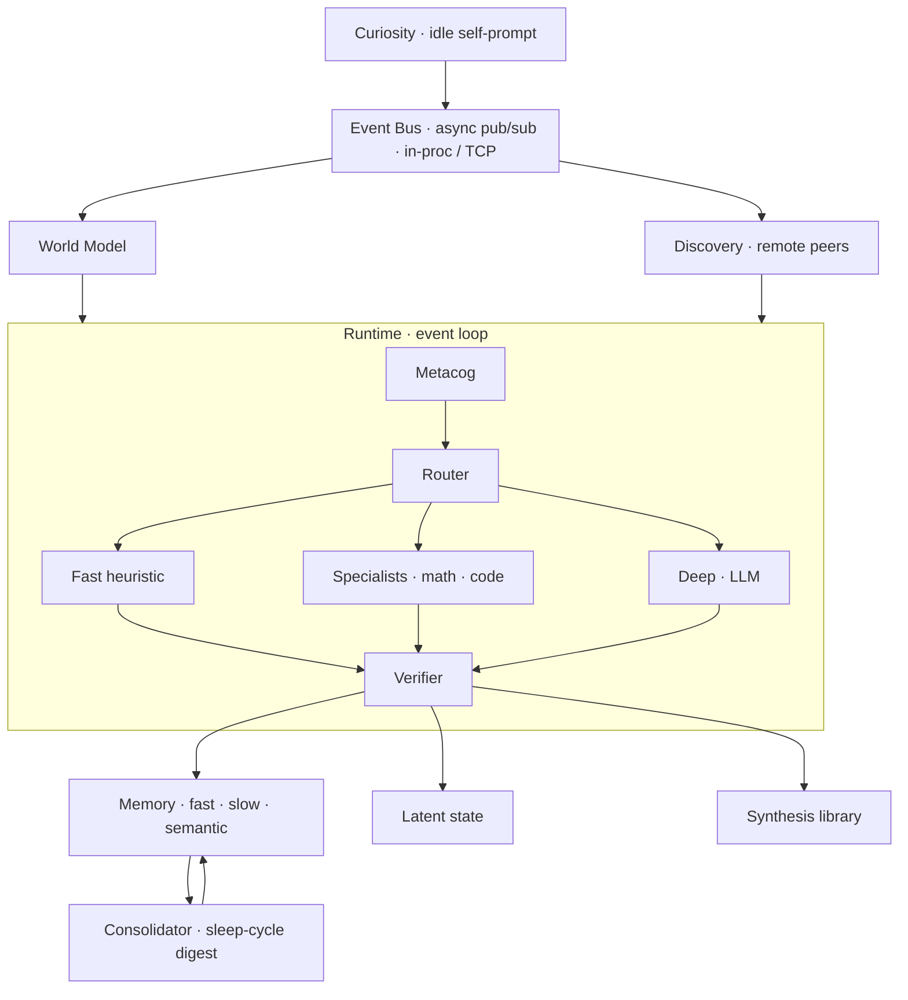

# mente

[](https://pypi.org/project/mente/)
[](https://pypi.org/project/mente/)
[](https://github.com/jspwrd/mente/actions/workflows/ci.yml)
[](https://jspwrd.github.io/mente/)
[](LICENSE)

> *mente* (n., Latin / Italian / Spanish): **mind**.

A minimalist cognitive-architecture framework for Python. Build persistent,
event-driven agents — with heterogeneous reasoner tiers, semantic and episodic
memory, program synthesis that grows a verified-primitive library, a
queryable self-model, a curiosity loop, and a distributed bus for specialist
peers.

Stdlib-only core. ~3,000 lines. No abstractions you can't read in an afternoon.

```bash
./mente
```

That's it. No install needed. Python 3.11+.

---

## Why mente

Most agent frameworks either wrap one LLM in ten layers of abstraction
(LangChain / LangGraph), or ship a consumer product around messaging apps
(OpenClaw). mente takes a different shape: a **persistent reasoning process**
where fast heuristics, specialists, and a deep LLM tier cooperate through a
single event bus, memory is tiered, tools are typed, every response is
verified, and new capabilities are *synthesized and promoted to the library
at runtime*.

It's meant for people who want to build agents without buying into a
framework's worldview.

**Compared to:**

| | LangChain / LangGraph | OpenClaw | mente |
|---|---|---|---|
| Size | 200K+ LOC | large daemon | ~3,000 LOC |
| Runtime deps | 40+ transitive | many | 0 (stdlib only; LLM optional) |
| Agent shape | one LLM + chains | one agent, many skills | population of tiered reasoners |
| Memory | mostly ephemeral | markdown files | latent + fast + slow (SQLite) + semantic (cosine) |
| Growth | static tools | human-authored skills | program synthesis with verified-primitive library |
| Background cognition | none | heartbeat | curiosity loop + sleep consolidation |
| Multi-process | via services | single daemon | federation protocol over TCP bus |
| Readable in one sitting | no | no | yes |

---

## Quickstart

```bash
git clone https://github.com/jspwrd/mente.git
cd mente
./mente             # interactive REPL
```

Try:

```
you> hello
mente[fast.heuristic]> Hi — I'm online.
you> remember that redis uses AOF for persistence
mente[fast.heuristic]> Noted: redis uses AOF for persistence.
you> what do you know about databases?
mente[fast.heuristic]> About 'databases': redis uses AOF for persistence (score 0.18); ...
you> compute the 15th fibonacci number
mente[specialist.synthesis]> fib(n=15) = 610
you> /library
  lib.fib.3ddeaa  entry=fib  calls=1
you> /quit
```

State persists under `.mente/` — run it again and the turn counter keeps
climbing, the fib primitive is already registered as a tool, and notes are
still searchable.

---

## All subcommands

```bash
./mente run         # interactive REPL (default)
./mente demo        # scripted walkthrough — watch the router pick reasoners per intent
./mente federated   # hub + specialist peer co-hosted, real TCP bus between them
./mente peer        # run only the math specialist peer (for multi-terminal setups)
./mente test        # smoke tests (bus, synthesis, semantic memory)
./mente reset       # wipe all .mente* state directories
./mente --help
```

Inside the REPL, slash commands peek at internals:

```
/state     current latent state
/library   synthesized primitives (persistent, reused)
/bus       last 20 events on the bus
/digest    force a consolidation digest now
/help      list commands
/quit      exit
```

---

## Installing as a package

```bash
uv add mente                                # core (stdlib only)
uv add 'mente[llm]'                         # adds anthropic SDK for the deep tier
uv add 'mente[embeddings]'                  # adds voyage embeddings
```

pip works too: `pip install mente`, `pip install 'mente[llm]'`, etc.

```python
import asyncio
from pathlib import Path
from mente.runtime import Runtime
from mente.types import Intent

async def main():
    rt = Runtime(root=Path(".mente"))
    await rt.start()
    r = await rt.handle_intent(Intent(text="what is the factorial of 10"))
    print(r.text)    # factorial(n=10) = 3628800
    await rt.shutdown()

asyncio.run(main())
```

---

## Running with real Claude

```bash
pip install 'anthropic>=0.40.0'
export ANTHROPIC_API_KEY=sk-ant-...
./mente
```

The deep tier auto-detects the key and swaps in `claude-opus-4-7` with
adaptive thinking + prompt caching. Everything else stays the same — nothing
in the router, verifier, or memory layer changes.

---

## Multi-process federation

```bash
./mente federated --port 7722
```

Runs a coordinator + a math specialist peer in the same process with a real
TCP bus between them. Math intents route to the peer over the bus
(`remote:peer.math:specialist.math`); everything else stays local. Graceful
degradation on peer disconnect.

For separate terminals:

```bash
# Terminal 1
./mente peer --port 7722

# Terminal 2
MENTE_BUS_ROLE=hub MENTE_BUS_PORT=7722 ./mente run
```

---

## Architecture



Full walkthrough: [`docs/architecture.md`](docs/architecture.md) (with the same diagram).

---

## Extending

| Want to add… | Protocol / package | See |
|---|---|---|
| a new reasoner tier | `Reasoner` Protocol | `docs/extending.md` |
| a typed tool | `ToolRegistry.register` decorator | `docs/extending.md` |
| a new specialist | `mente.specialists` | `docs/extending.md` |
| a real embedder | `mente.embedders.Embedder` | `docs/extending.md` |
| a real synthesizer | `mente.synthesizers.Synthesizer` | `docs/extending.md` |
| a custom verifier | `mente.verifiers.StructuredVerifier` | `docs/extending.md` |

Each protocol is ~10 lines. Drop your implementation in, wire it into
`Runtime.reasoners` or the right registry, done.

---

## Example gallery

- [`examples/coding_agent.py`](examples/coding_agent.py) — synthesis + library reuse
- [`examples/research_agent.py`](examples/research_agent.py) — semantic memory ingestion + search
- [`examples/personal_org.py`](examples/personal_org.py) — world model + curiosity loop

Each is ~100 lines, runs with `python examples/<name>.py`, uses only the public API.

---

## Tutorials & docs

- [Quickstart](docs/tutorials/quickstart.md) — first REPL session, 15 minutes
- [Build an Agent](docs/tutorials/build-an-agent.md) — a journaling agent in 80 lines
- [Extending](docs/extending.md) — all protocols, minimal examples
- [Architecture](docs/architecture.md) — subsystem-by-subsystem deep dive

Docs site (auto-generated API reference): `mkdocs serve` locally, or GitHub
Pages once the repo is up.

---

## What's a stub

Honest list of current stand-ins, each behind a protocol so they can be
swapped without touching callers:

| Component | Shipping impl | Drop-in path |
|---|---|---|
| Embedder | character-n-gram hash (offline) | `VoyageEmbedder` via `mente[embeddings]` |
| Deep reasoner | simulated latency (offline) | `AnthropicReasoner` via `mente[llm]` |
| Synthesizer | templated (fib / factorial / power) | `LLMSynthesizer` via `mente[llm]` |
| Verifier | hand-coded heuristics | `CompositeVerifier` + future trained verifier |
| Metacog | hand-coded pattern coverage | trained head (Phase 2) |
| Discovery | unauthenticated announcements | signed manifests (Phase 2) |

These are labelled Phase 1 in each module's top docstring.

---

## Project status

**Alpha.** API may change between 0.x releases. Pinning `mente==0.1.0` is
safe; upgrading minor versions may require code changes.

- 388 unit/integration tests passing
- CI on Python 3.11 / 3.12 / 3.13 × ubuntu / macos
- MIT licensed
- [Roadmap](ROADMAP.md)
- [Changelog](CHANGELOG.md)

---

## Contributing

See [CONTRIBUTING.md](CONTRIBUTING.md). Short version: fork, branch, write a
test, open a PR. Code of conduct: [Contributor Covenant 2.1](CODE_OF_CONDUCT.md).
Security reports: see [SECURITY.md](SECURITY.md).

---

## License

MIT. See [LICENSE](LICENSE).

---

## Troubleshooting

- **`python 3.11+ required`** — upgrade or set `MENTE_PYTHON=/path/to/python3.11`.
- **Hangs on Ctrl-C in federated REPL** — `input()` blocks the event loop
  cleanup; press Enter first, then `/quit`.
- **`port already in use`** — another mente hub is running; change `--port`
  or `./mente reset` and retry.
- **`anthropic not installed`** — run with `pip install 'mente[llm]'` or
  export no `ANTHROPIC_API_KEY` to use the stub deep tier.
