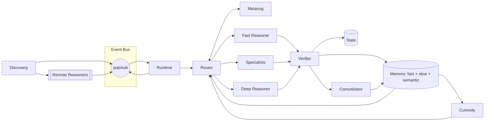

# Architecture

ARIA is a persistent, event-driven reasoning process. The design rejects the
"one big LLM call per turn" loop in favor of a nervous system: many small
subsystems talking over a shared bus, with tiered reasoners that specialize
and a router that picks between them based on predicted cost and confidence.

## §1. Nervous System: the Event Bus

Every subsystem in ARIA is a publisher or subscriber. There is no god-object
runtime wiring direct calls; events on topics like `turn.input`,
`router.dispatched`, `verifier.verdict`, and `memory.digest` drive the whole
process forward. Wildcard topic subscriptions let observers (logging, the
REPL's `/bus`, peers) tap anywhere without the producers knowing.

This decoupling is what lets the rest of the architecture stay small. New
subsystems plug in by subscribing; no existing code changes.

## §2. Runtime: the Process that Owns the Stack

The runtime is the long-lived event loop. It owns the bus, instantiates every
subsystem, and keeps them alive across turns. Its job is boring on purpose:
accept input, publish it, let the architecture react, collect the reply.
Persistence (state checkpointing, episode logging) hangs off subscribers, not
the runtime itself.

## §3. Router: Cost/Confidence Dispatch

When a turn's intent is classified, the router asks metacog for a prediction
per reasoner: how likely is each one to handle this well, and how much will it
cost? It dispatches to the cheapest confident option first and escalates on
low verifier confidence. The policy is deliberately readable — no learned
gating network, just predictable tables that you can debug.

## §4. Metacog: Per-Reasoner Predictions

Metacog maintains rolling estimates of each reasoner's success rate and
latency per intent class. It's the thing that lets the router avoid spending
a deep-tier call on "hello". When the router escalates, metacog updates its
estimates — the system learns which tier handles which kind of request.

## §5. Reasoners: Fast, Specialist, Deep

Three families live behind a common interface:

- **Fast** — pattern-matching heuristics. Sub-millisecond. Handles identity,
  memory recall, introspection, and easy pattern-recognition intents.
- **Specialists** — narrow, trusted evaluators (e.g. the math specialist with
  a safe arithmetic evaluator). Used when pattern-matching says "this is a
  specific domain".
- **Deep** — an optional Claude reasoner with adaptive thinking and prompt
  caching. Used when fast and specialists decline or fall under the
  confidence threshold.

Every reasoner returns a structured response with confidence and optional
tool/program-synthesis hooks.

## §6. Memory: Fast, Slow, Semantic

Memory is tiered:

- **Fast** — TTL working memory. Survives the turn, expires within minutes.
- **Slow** — SQLite episodic store. Every turn is a row; queryable by
  time, topic, outcome.
- **Semantic** — n-gram-hash embeddings with cosine search. Zero external
  dependencies; good enough to recall "what did I say about X last week".

Writes fan out via the bus; reads happen inside reasoners via a thin memory
API.

## §7. Synthesis: Verified Primitives

Some intents trigger program synthesis: the reasoner proposes Python code,
it's run in a sandbox against examples, and on success it's promoted to a
persistent primitive in the library. Next time the same intent class comes
in, the primitive runs directly — no LLM call. The library is the moat:
ARIA gets faster and more competent the longer it runs.

## §8. Consolidator & Curiosity

The consolidator is ARIA's sleep cycle. It scans recent episodes, distills
them into digests (summaries, novel facts, failed assumptions), and writes
those digests back into semantic memory. Curiosity reads world-model gaps
and consolidator output to generate self-prompts during idle time — ARIA
pokes at what it doesn't know.

## §9. Discovery & Federation

Peers announce their capabilities on a well-known topic. The router sees
remote reasoners as first-class dispatch targets. The transport layer is
pluggable: in-process, TCP today, NATS tomorrow. A math specialist peer on
another machine is functionally identical to an in-process specialist — the
bus abstracts the difference.

## §10. Verifier: Structured Verdicts

Every reasoner's output is handed to the verifier before it reaches the
user. Verification produces a verdict with structured reasons — useful for
debugging, useful for metacog's updates, and useful for the router when it
decides whether to escalate. Verification is step-wise: a synthesized
program is verified against examples; a factual answer is verified against
memory; a tool call is verified against its schema.

The result is a system where the interesting behavior emerges from the
interaction of small, honest subsystems — not from a single monolithic
prompt.
